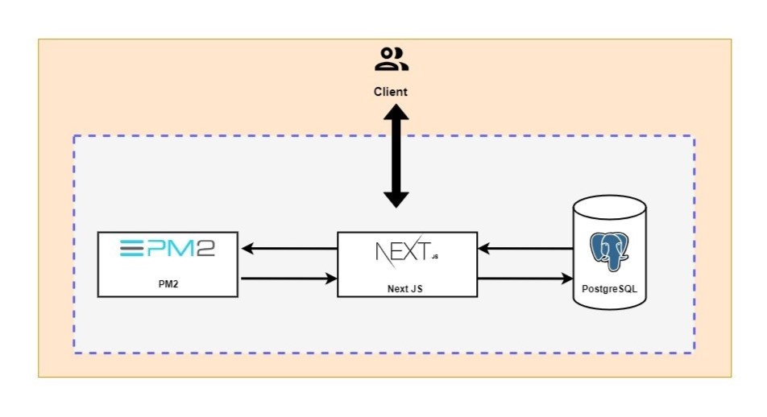

# Fullstack To-do application using Next.js integrated with a PostgreSQL database

- [Diagram for Fullstack To-do application](#diagram-for-fullstack-to-do-application)
- [Description](#description)
- [Purpose](#purpose)
- [Tech Stack](#tech-stack)
- [Directory Structure](#directory-structue)
- [Prerequisites](#prerequisites)
- [Setup](#setup)
- [Use Cases](#use-cases)
- [References](#references)
- [License](#license)
- [Further Improvement Suggestions](#further-improvement-suggestions)

### Diagram for Fullstack To-do application  




### Description  
This straightforward Fullstack To-do application is built using dynamic and efficient Next.js, seamlessly integrated with a PostgreSQL database. This powerful combination ensures a smooth user experience, along with robust capabilities for data storage and retrieval.

### Purpose  
This application is constructed for future automation, serving as a testing ground for containerization, pipeline setup for application deployment, and as a production-ready boilerplate.

### Tech Stack  
	- Next.js - v12,   
	- JavaScript,   
	- PostgreSQL database

### Directory Structue   
```shell
.
├── README.md
├── components
│   ├── layout.js
│   ├── todo-list.js
│   └── todo.js
├── db
│   └── index.js
├── instructions
│   ├── db.md
│   ├── setup.sql
│   └── steps_taken.md
├── next.config.js
├── package-lock.json
├── package.json
├── pages
│   ├── _app.js
│   ├── api
│   └── index.js
├── public
│   ├── favicon.ico
│   ├── material-symbols_delete-outline-sharp.svg
│   └── vercel.svg
└── styles
    ├── globals.css
    ├── layout.module.css
    ├── todo-list.module.css
    └── todo.module.css

```

### Prerequisites

Before proceeding with the setup, ensure that your system meets the following technical requirements:

1. **Node.js Installation:**
   Ensure that Node.js is installed on your machine. If not, you can download and install it from the official [Node.js website](https://nodejs.org/).

2. **PostgreSQL Server and Client:**
   Verify the availability of both the PostgreSQL server and client on your machine. If not already installed, you can obtain them from the official [PostgreSQL website](https://www.postgresql.org/).

These prerequisites are essential to guarantee a smooth and successful setup of the required environment for the project.

### Setup 

To initialize and run this project, follow the outlined steps below:

1. Clone this repository:

    ```bash
    git clone https://github.com/sip2023/to-do-next-12.2.3.git
    ```

2. Navigate to the project directory:

    ```bash
    cd to-do-next-12.2.3
    ```

3. Install project dependencies:

    ```bash
    npm install
    ```

4. Set up the PostgreSQL database by executing the SQL file located in the `instructions` folder. Utilize the following command:

    ```bash
    psql -U your_username -d your_database -a -f instructions/setup.sql
    ```

5. Configure the `.env` file in the project root with the necessary credentials, following the structure of the `env.md` file in instruction folder.

6. If PM2 is not installed, install it globally:

    ```bash
    npm install -g pm2
    ```

7. Once installed, build the project:

    ```bash
    npm run build
    ```

8. Start the project using PM2:

    ```bash
    pm2 start 'npm start' --name app
    ```

9. Check the project outputs on port 3000 of the machine.

### Use Cases

This project addresses key technical aspects such as containerization, pipeline setup, and container orchestration.

### References

1. [Next JS Docs](https://nextjs.org/docs)
2. [fullstackbook-todo-nextjs](https://github.com/fullstackbook/fullstackbook-todo-nextjs)

### License

This project is licensed under the MIT license.

### Further Improvement Suggestions

1. Implement proper styling.
2. Refactor file and folder names for consistency.
3. Expand the application with additional routes.
4. Consider incorporating date and time functionalities for enhanced features.
